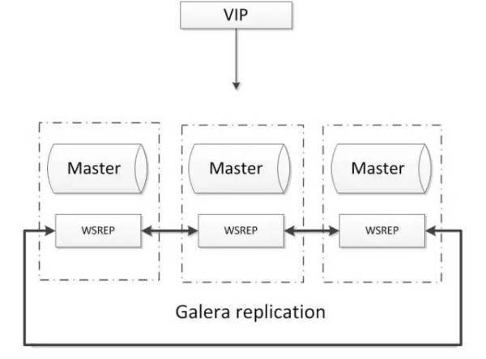

#  Galera
基于Galera的MySQL高可用集群， 是多主数据同步的MySQL集群解决方案，使用简单，没有单点故障，可用性高。常见架构如下：

**优点：**

1. 多主写入，无延迟复制，能保证数据强一致性；

2. 有成熟的社区，有互联网公司在大规模的使用；

3. 自动故障转移，自动添加、剔除节点；

**缺点：**

1. 需要为原生MySQL节点打wsrep补丁

2. 只支持innodb储存引擎

3. 至少三节点；